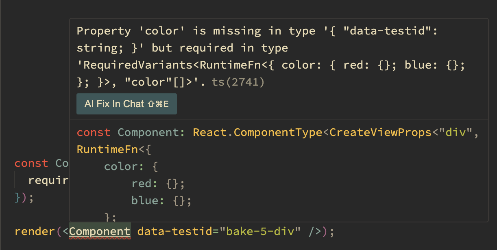
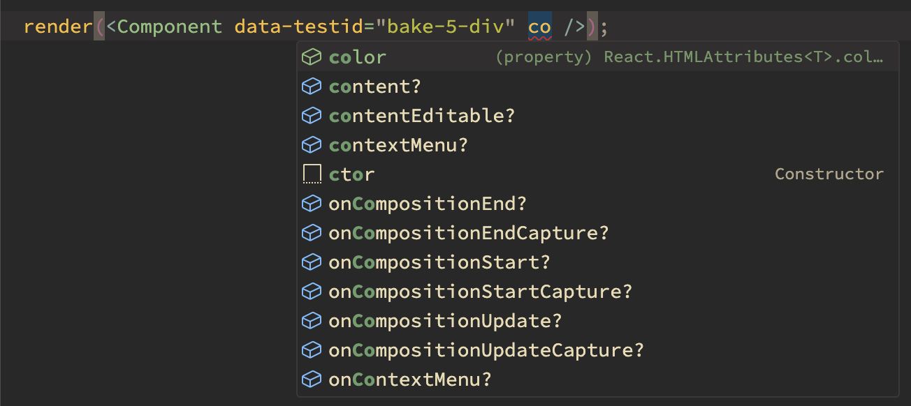
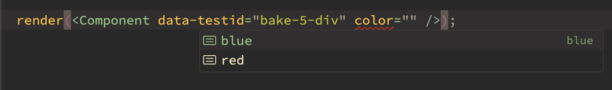

# vanilla-extract-react-bake

Heavily inspired by `styled` from `stitches`, this package provides a `bake` function that can be used to generate typed components that reflect a vanilla-extract recipe, where variants are props.

## Installation

```sh
npm install --save vanilla-extract-react-bake
```

## Usage

Create a recipe using `@vanilla-extract/recipes`.

```ts
import { recipe } from '@vanilla-extract/recipes';

export const myRecipe = recipe({
  base: {
    color: 'gray'
  },

  variants: {
    size: {
      small: {
        fontSize: 12
      },
      medium: {
        fontSize: 16
      },
      large: {
        fontSize: 20
      }
    }
  }
});
```

Create a component using `bake` with your recipe.

```tsx
import { bake } from 'vanilla-extract-react-bake';
import { myRecipe } from './myRecipe.css';

export const MyComponent = bake('div', myRecipe);
```

Use that component with props that match the variants in your recipe.

```tsx
import { MyComponent } from './MyComponent';

export const MyApp = () => {
  return (
    <MyComponent size="large">Hello world</MyComponent>
  );
};
```

## Features

### Simple classname components

Since we're already piped to create components with `bake`, we can also use it to create simple components that just have a classname.

```tsx
const MyComponent1 = bake('div');
const MyComponent2 = bake('div', 'some-classname');
const MyComponent3 = bake('button', [
  'my',
  'list',
  'of',
  'classnames'
]);
```

### Required variants

I'd love for there to be a way to infer whether a variant is required or not, but that doesn't seem possible with the current types in `vanilla-extract`. So instead, you can mark a variant as required in the config, which is the optional third argument.

```tsx
const MyComponent = bake('div', basic, {
  required: ['requiredVariantName']
});
```

### Variant prop passthrough

By default, we pull out the variants from the props before we spread them onto the resulting component. In the vast majority of cases, this is what you'd want, because there is no html attribute that has the same name as your variant, and you'd make react mad at you.

However, in some cases, you may want to name one of your variants after an html attribute. This tends to happen with `disabled` or `required` or something like that on form elements. For these cases you can use the `forward` config option:

```tsx
const MyComponent = bake('div', basic, {
  forward: ['disabled']
});
```

This will both trigger the `disabled` variant, and pass the `disabled` prop through to the resulting component.

### Classname merging

The resulting components from `bake` can be used with other classnames, and the resulting classnames will be merged together.

```tsx
const MyComponent = bake('div', 'some-classname');

export const MyApp = () => {
  return <MyComponent className="another-classname" />;
};
```

The resulting html will append them together in the order of the `bake` classname, and then the inlined classname.

## Why is this good?

The code for actually building the components is relatively straightforward, and is only a few lines of code. The primary benefit here is the type safety that comes with it. Much like with `vanilla-extract` directly, a large amount of your code is built out at compile time. So you ship less javascript to the client, you have types that never drift from your styles, and you have to write less code by hand.

It's primarily good for folks who spend a lot of time reimplementing their style variants as javascript props on their components, a common job for people making design systems, or just reusable components in general. `bake` allows you to have a single place where your variants are defined, and then outputs a very well-typed component that can be used with those variants, and updates when the variants change.

It's especially apparent when you look at the intellisense for components that come out of `bake`.

### A basic recipe with one variant


### The variants are now known, and the config can be used to mark some of them as required


### The error describes the specific prop that is missing



### IntelliSense for the component itself shows the variants and their values





```

```
