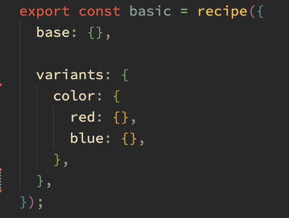

# vanilla-extract-react-bake

Heavily inspired by `styled` from `stitches`, this package provides a `bake` function that can be used to generate typed components that reflect a vanilla-extract recipe, where variants are props.

## Installation

```sh
npm install --save vanilla-extract-react-bake
```

## Usage

Create a recipe using `@vanilla-extract/recipes`.

```ts
import { recipe } from '@vanilla-extract/recipes';

export const myRecipe = recipe({
  base: {
    color: 'gray'
  },

  variants: {
    size: {
      small: {
        fontSize: 12
      },
      medium: {
        fontSize: 16
      },
      large: {
        fontSize: 20
      }
    }
  }
});
```

Create a component using `bake` with your recipe.

```tsx
import { bake } from 'vanilla-extract-react-bake';
import { myRecipe } from './myRecipe.css';

export const MyComponent = bake('div', myRecipe);
```

Use that component with props that match the variants in your recipe.

```tsx
import { MyComponent } from './MyComponent';

export const MyApp = () => {
  return (
    <MyComponent size="large">Hello world</MyComponent>
  );
};
```

## Why is this good?

The code for actually building the components is relatively straightforward, and is only a few lines of code. The primary benefit here is the type safety that comes with it. Much like with `vanilla-extract` directly, a large amount of your code is built out at compile time. So you ship less javascript to the client, you have types that never drift from your styles, and you have to write less code by hand.

It's primarily good for folks who spend a lot of time reimplementing their style variants as javascript props on their components, a common job for people making design systems, or just reusable components in general. `bake` allows you to have a single place where your variants are defined, and then outputs a very well-typed component that can be used with those variants, and updates when the variants change.

It's especially apparent when you look at the intellisense for components that come out of `bake`.

### A basic recipe with one variant


